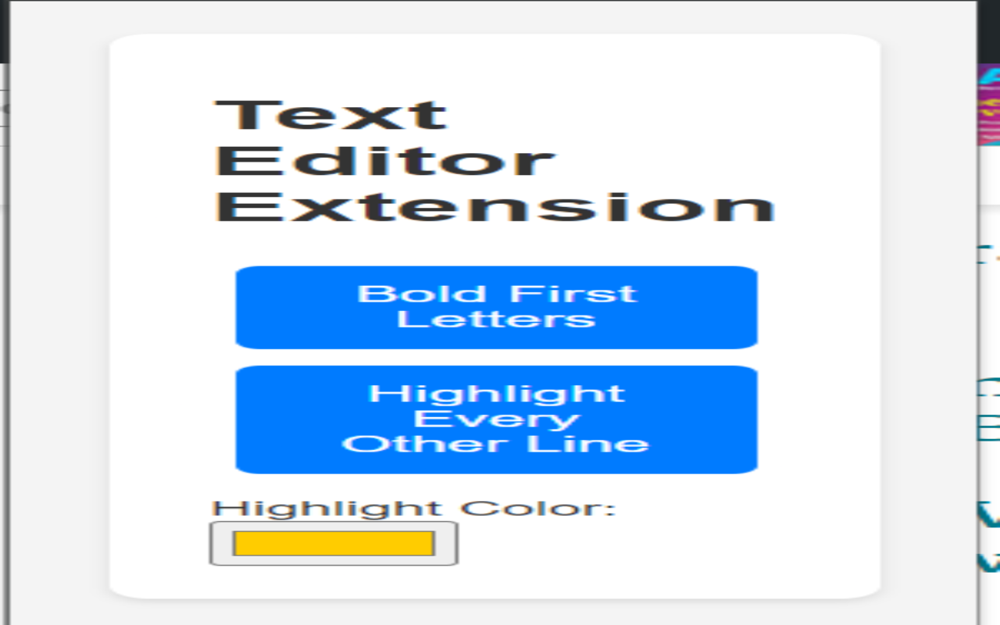
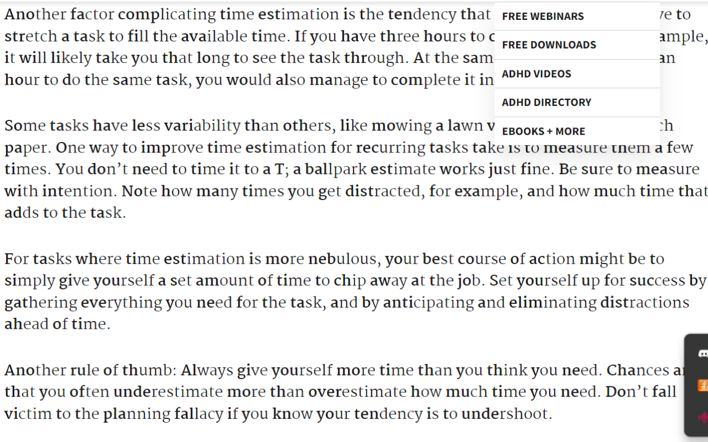
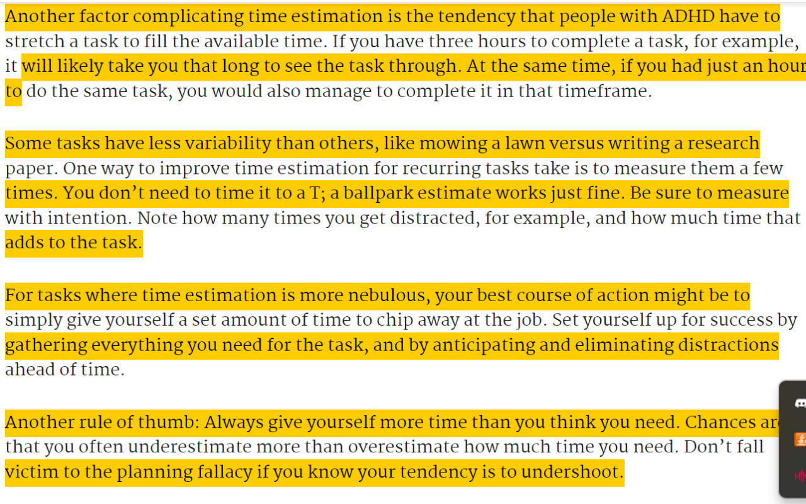

# <a href="https://chromewebstore.google.com/detail/adhd-friendly-text-enhanc/mnagpckgpcigjbenomcdpfifellpehnb" target="_blank"> ADHD-Friendly Text Enhancer Extension </a>

## Description
This is a Chrome extension that enhances the readability of text on webpages. It is designed to help people with ADHD read more efficiently by improving focus and comprehension. The extension uses a combination of text formatting and color coding to make text more visually appealing and easier to read.

## Features
- **Text Boldening**: First few letters of each word are boldened to help the reader quickly identify the start of each word.
- **Sentence Highlighting**: Sentences are highlighted in alternating colors to help the reader track their progress and maintain focus. Some spacing is also added between sentences to make them easier to distinguish.

## Usage
1. Install the extension by downloading the source code and loading it as an unpacked extension in Chrome.
2. Open a webpage with text content that you would like to enhance.
3. Select the text you want to enhance by clicking and dragging your mouse over it.
4. Click the extension icon in the Chrome toolbar to select the enhancement options you want to apply - boldening or highlighting.
5. Alternatively, you can use the keyboard shortcuts `Ctrk + Shift + Y`/`Cmd + Shift + Y` to bolden the selected text and `Ctrl + Shift + H`/`Cmd + Shift + H` to highlight the selected text.

## Screenshots

